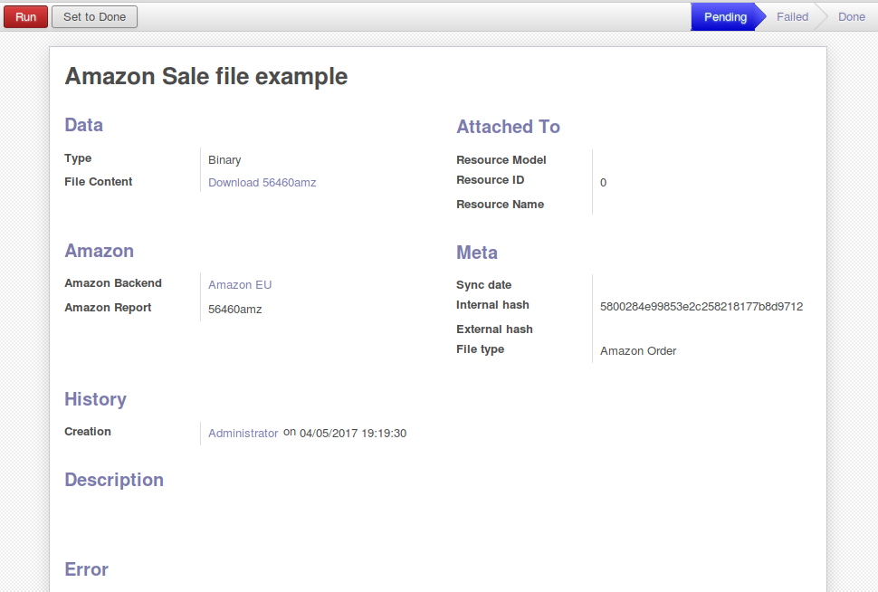
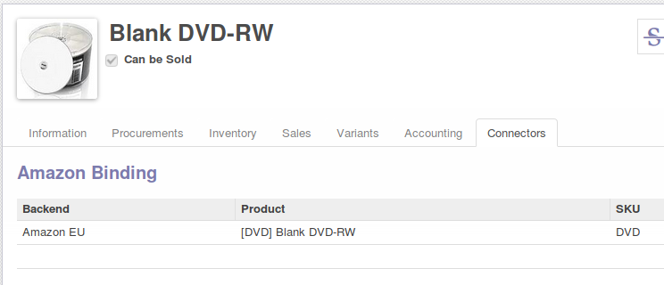
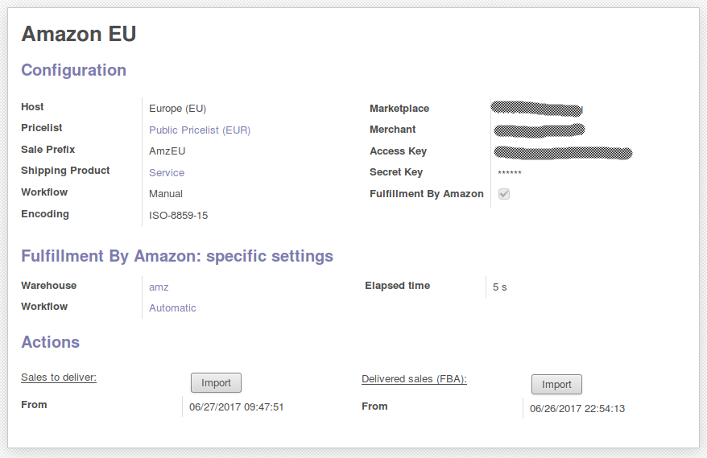

================
Connector Amazon
================

Supported features
==================

* Standard sales: sales to deliver
* FBA sales: delivered sales

Standard sales
---------------

Amazon reports are stored in ERP as below before its data are converted in sale

.. image:: connector_amazon/static/description/meta_amz.png
   :alt:
   :width: 800 px

|

----

Fulfillment By Amazon
---------------------

FBA sales are imported via the MWS api

Configuration
=============

Some items to set:

Product binding
---------------

|

.. image:: connector_amazon/static/description/prd_amz.png
   :alt: Product Binding
   :width: 800 px

|

* add a vat (with tax include) on your products (accounting tab)
* specify a backend on your products with (connectors tab)

----

Amazon Backend
--------------

|

.. image:: connector_amazon/static/description/backend.png
   :alt: Backend to store settings
   :width: 800 px

* in case of Fulfillment By Amazon (FBA) in the backend you should specify a warehouse
* optionnaly you may change the worfkflow to set an automatic one (for FBA at least)

|

Scheduled Actions to active
----------------------------

* Run Attachments Metadata
* Amazon FBA sale import

